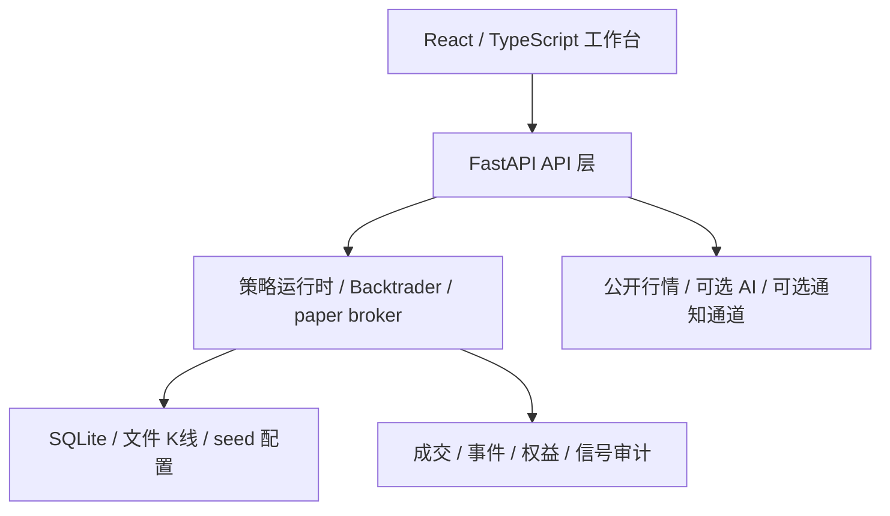

# QuantBase


[English](README_EN.md) | 简体中文

QuantBase 是一个开源量化研究底座，面向真实行情同步、策略回测、paper/simulation 执行、信号审计和风险复盘。它保留工程闭环，默认不连接真实资金，不提供收益承诺，也不把任何示例策略视为投资建议。

> 风险声明：QuantBase 仅用于技术研究、工程验证、回测和模拟盘演练。任何策略、信号、AI 输出、回测结果、示例配置和界面展示都不构成投资建议、收益承诺或风险承诺。真实交易、杠杆、衍生品和自动化下单都可能造成重大损失；请只在充分理解风险并自行承担责任时使用相关能力。完整说明见 [docs/DISCLAIMER.md](docs/DISCLAIMER.md)。

## 项目定位

QuantBase 不是一个单独的交易脚本，而是一套可扩展的量化研究工作台：

| 维度 | 说明 |
| --- | --- |
| 工程类型 | 全栈量化研究、回测、模拟执行和审计系统 |
| 主要技术 | Python 3.11、FastAPI、SQLite、React 18、TypeScript、Vite、Backtrader、CCXT |
| 默认边界 | paper/simulation only；真实账户和实盘执行默认关闭 |
| 数据原则 | 优先使用真实公开行情；缺数据应显式失败，不用 mock K 线伪装成功 |
| 开源范围 | 工程框架、策略接口、回测路径、模拟撮合、审计记录、页面工作台和示例 seed |

## 核心能力

- **行情与 K 线同步**：从公开交易所接口同步行情，维护本地文件 K 线缓存和同步状态。
- **策略注册框架**：通过统一 `BaseStrategy` 合约接入现货、合约、套利、AI 辅助等策略类型。
- **Backtrader 回测**：使用真实历史 K 线和明确手续费/滑点配置生成可复查结果。
- **paper broker**：模拟账户、持仓、成交、权益曲线、手续费、资金费和风险事件。
- **信号审计**：记录策略信号、投递状态和操作日志，帮助复盘策略行为。
- **前端工作台**：提供市场、策略、回测、模拟盘、监控、数据中心和 AI 研发页面。

## 架构概览



更完整的分层说明见 [docs/ARCHITECTURE.md](docs/ARCHITECTURE.md)。

## 快速开始

```bash
git clone https://github.com/Shadowell/QuantBase.git
cd QuantBase
./init.sh
```

启动本地服务：

```bash
./start.sh
# Frontend: http://localhost:8888
# Backend:  http://localhost:8889/api/v2
```

不启动长服务的基础检查：

```bash
./scripts/check.sh
```

## 环境变量

复制后端环境模板：

```bash
cp backend/.env.example backend/.env
```

默认情况下可以只运行前端构建、Python 编译和部分公开行情路径。涉及交易所私有 API、通知 webhook、AI provider key 或任何真实账户能力时，请只写入本地 `.env` 或部署密钥，不要提交到仓库。

Kairos/SuperPnL 这类本地模型能力是可选重依赖。基础安装不会拉取 torch 或模型仓库；需要本地模型推理时再安装：

```bash
pip install -r backend/requirements-ai.txt
```

## 示例策略

`data/seed/strategies.json` 内置 10 个社区版 demo seed，用于展示策略配置结构和 paper/simulation 启动方式。它们覆盖现货 CTA、合约 CTA、Donchian、网格、马丁、做市、市场中性、跨所资金费率和低杠杆趋势等样例；这些不是实盘建议，也不是经过收益目标筛选的交易资产。

## 文档入口

| 文档 | 内容 |
| --- | --- |
| [docs/README.md](docs/README.md) | 文档总导航 |
| [docs/ARCHITECTURE.md](docs/ARCHITECTURE.md) | 技术架构和数据流 |
| [docs/spec.md](docs/spec.md) | 长期产品规格和行为边界 |
| [docs/pages/](docs/pages/) | 页面级设计文档 |
| [docs/OPEN_SOURCE_SCOPE.md](docs/OPEN_SOURCE_SCOPE.md) | 开源社区版保留与剥离范围 |
| [docs/DISCLAIMER.md](docs/DISCLAIMER.md) | 免责声明 |

## 开源治理

- License: Apache-2.0，见 [LICENSE](LICENSE)。
- 贡献说明见 [CONTRIBUTING.md](CONTRIBUTING.md)。
- 安全问题请按 [SECURITY.md](SECURITY.md) 报告。

QuantBase 的目标是提供一套可靠、可审计、可扩展的量化研究基础设施。请先研究、再模拟，最后再由你自己判断是否需要任何真实执行。
