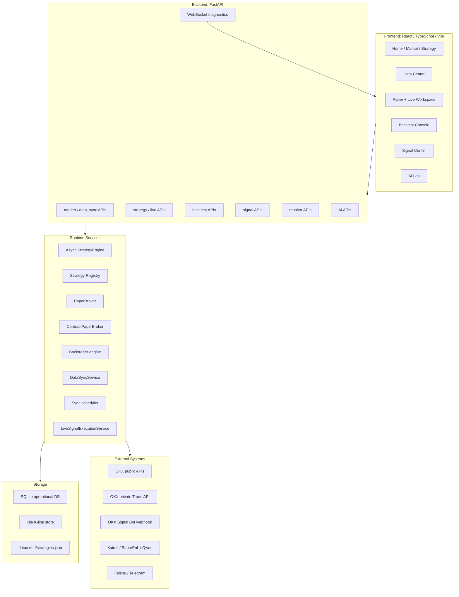

# QuantBase 技术架构

本文档面向开发者、维护者和 AI Agent，说明 QuantBase 的主要运行层、数据流、持久化边界和验证方式。README 只保留入口视角，长期产品行为以 [docs/spec.md](spec.md) 为准，开源社区版边界以 [docs/OPEN_SOURCE_SCOPE.md](OPEN_SOURCE_SCOPE.md) 为准。

## 1. 架构目标

QuantBase 的架构围绕四个原则设计：

1. **研究优先**：默认运行 paper/simulation，真实执行必须走独立的实盘工作台、权限检查、预检和二次确认。
2. **真实数据优先**：行情、回测、预测和截图都不能使用 mock 或合成数据伪装成功。
3. **可恢复**：数据同步、回测任务、AI 任务和策略运行状态尽量落库，浏览器断开或服务重启后仍能看到历史和中断状态。
4. **可审计**：策略、成交、持仓、信号、投递、实盘订阅、同步任务和文档进度都要有可追踪记录。

## 2. 总体分层



## 3. 代码结构

| 路径 | 责任 |
| --- | --- |
| `frontend/src` | React 工作台、页面状态、图表、弹窗、API client |
| `backend/app/api/endpoints` | FastAPI 路由，按 market/backtest/live/sync/signals/monitor/AI 分组 |
| `backend/app/core/execution` | `BaseStrategy`、策略引擎、现货 paper broker、合约 paper broker |
| `backend/app/strategies` | 内置策略实现，策略名必须带 `[现货]` 或 `[合约]` 前缀 |
| `backend/app/services` | 注册表、数据同步、K 线文件、回测、信号、实盘订阅、AI、通知等服务 |
| `data/seed/strategies.json` | 可运行 demo 策略 seed；初始化时导入本地 SQLite |
| `docs/spec.md` | 长期产品和技术事实 |
| `docs/progress.md` | 进度、验证、部署、遗留事项 |

## 4. 前端工作台

前端使用 React、TypeScript 和 Vite。页面以业务工作台组织，而不是单一行情页：

- `/`：首页，展示系统入口、行情摘要和关键任务。
- `/market`：行情列表和合约详情，合约 tab 展示合约名和 USDT 永续详情。
- `/strategy`：策略库、资产类别筛选、策略解释、参数摘要。
- `/backtest`：多实例回测控制台，实例完成后并入同一列表而不是移动到单独历史表。
- `/live`：模拟盘实例控制台和实盘工作台。
- `/signals`：信号审计、人工确认、通道配置和投递记录。
- `/monitor`：运行策略聚合 KPI、持仓、收益、告警和推送配置。
- `/data`：K 线覆盖、同步任务、定时同步、交易对维护。
- `/ai-lab`：AI 策略猎手、自主模拟、参数优化。

前端不把浏览器本地状态当作最终事实。关键实例、任务、信号、回测、同步状态和模拟盘账户曲线都来自后端 API 或 SQLite 持久化结果。模拟盘运行时会把正权益采样写入 `strategy_equity_samples`，`/api/v2/live/equity_curve` 从该表读取并在服务重启后恢复页面曲线缓存。

## 5. API 层

`backend/app/api/api.py` 汇总 API router。主要分组：

| API | 用途 |
| --- | --- |
| `/api/v1/health` | 健康检查 |
| `/api/v2/market/*` | 行情、K 线、交易对、市场详情 |
| `/api/v2/data_sync/*` | 同步启动、状态、任务列表、定时同步、数据统计 |
| `/api/v2/strategy/*` | 策略库、策略详情、配置 |
| `/api/v2/live/*` | paper 实例、dashboard、事件、实盘工作台 |
| `/api/v2/backtest/*` | 回测提交、任务状态、继续、结果查询和删除 |
| `/api/v2/signals*` | 信号查询、确认、取消、重试 |
| `/api/v2/signal-channels*` | OKX Signal Bot 通道和测试 |
| `/api/v2/monitor/*` | 组合监控、告警、收益卡片 |
| `/api/v2/ai/*` | AI 研究任务、预测、策略生成和优化 |

## 6. 策略运行链路

策略运行由 `StrategyEngine` 管理：

1. 前端通过 `/api/v2/live/*` 创建或启动 paper 实例。
2. 后端读取 `strategy_key`，通过 `strategy_registry.py` 找到策略类。
3. 引擎加载策略配置、symbol universe、timeframe、exchange、初始资金和 paper/live 标识。
4. 引擎预热真实 K 线，预热阶段 broker 不产生真实 paper 成交。
5. 每根已确认 bar 到达后调用策略 `on_bar(bar)`。
6. 策略调用 broker 接口表达交易意图。
7. Broker 计算成交、余额、持仓、手续费、资金费、强平和事件。
8. 状态写入 SQLite，并通过 REST/WebSocket 返回给前端。

### 6.1 策略接口

策略继承 `BaseStrategy`。现货策略使用 `buy/sell/close_position`，合约策略使用 `open_contract/close_contract/get_contract_position`。合约策略不应通过现货接口执行。

### 6.2 现货 paper broker

`PaperBroker` 负责：

- quote 金额和 base 数量换算。
- 现金、持仓、手续费和权益计算。
- 现货成交写入 `strategy_trades`。
- 运行诊断和系统事件写入 `strategy_events`。

### 6.3 合约 paper broker

`ContractPaperBroker` 采用 OKX USDT 永续语义：

- `BTC/USDT:USDT` 这类 CCXT symbol 会对应 OKX `BTC-USDT-SWAP`。
- 张数换算使用 `ctVal`、`lotSz`、`minSz`、`tickSz` 等 instrument metadata。
- 支持 long/short 独立仓位、逐仓默认保证金配置、杠杆上限、资金费率、已实现/未实现盈亏和强平事件。
- 默认 paper-only；真实 OKX API 下单只允许通过受控实盘工作台。

## 7. 回测链路

回测由 Backtrader 路径执行：

1. 前端提交策略、日期、资金、手续费 bps、滑点 bps 和 symbol 范围。
2. `/backtest/run_job` 写入 `backtest_jobs` 并排入后台任务。
3. 引擎从文件 K 线 store 读取真实 K 线；旧 SQLite 表仅为 fallback。
4. 如果请求区间缺真实数据，后端尝试低频 OKX 拉取补齐；仍无法覆盖时返回可操作的缺数据错误。
5. 结果写入持久化记录，前端把运行实例和历史结果合并到同一列表。

服务重启时，内存中的 queued/running/cancelling 回测任务会标记为 `interrupted`。继续回测会复用保存的请求重新排队；当前不做 Backtrader 执行状态 checkpoint。

## 8. 数据同步和 K 线存储

K 线文件 store 是主要读取源。数据中心统计、行情 K 线、回测基准和预测对比都应优先读文件 store。

同步任务的持久化模型：

| 表 | 作用 |
| --- | --- |
| `sync_jobs` | 一次同步操作的范围、状态、统计、完成时间、错误摘要 |
| `sync_job_items` | symbol + timeframe 的执行状态、checkpoint、拉取/新增数量 |
| `sync_metadata` | 每个交易对/周期的覆盖位置和最后同步时间 |

同步支持断线继续和服务重启恢复。浏览器刷新不会丢失任务明细；后端启动后会恢复最老的 queued/running 任务，跳过已完成 item，从 checkpoint 继续。

文件写入使用同目录临时文件和原子替换。如果 parquet 分区不可读，会隔离坏文件并允许后续从交易所数据重建。

## 9. 信号中心和实盘工作台

QuantBase 有两条外部执行路径，边界不同：

### 9.1 Signal Center

Signal Center 面向 OKX Signal Bot webhook：

- 来源是合约 paper 成交后的标准化 intent。
- 策略和通道必须显式启用。
- 可按策略设置自动发送或人工确认。
- 通道保存 masked webhook/token、symbol/action 白名单、保证金限制和投递记录。
- 每次投递写入 `signal_deliveries`，便于失败重试和审计。

### 9.2 实盘工作台

实盘工作台面向 OKX Trade API：

- 先添加 live account，后端校验私有读权限和 Trade permission。
- 纸面策略加入实盘策略列表后，绑定一个或多个实盘账户。
- 预检会验证策略、账户、权限、市场类型、合约能力、仓位模式和 order-precheck 能力。
- 部署必须二次确认，创建 `live_strategy_subscriptions`。
- 源 paper 策略继续运行，标准化信号由 `LiveSignalExecutionService` 分发到绑定账户。

真实执行代码必须有明确的 `is_paper_trading=false` 和操作者确认路径。paper 策略的账户、风控、监控和通知不应读取真实账户私有状态作为运行依据。

## 10. AI 和模型服务

AI 相关模块包括：

- Kairos 价格路径预测。
- SuperPnL 15m 横截面预测。
- Qwen/DashScope 兼容 LLM 的策略研究、策略猎手和参数优化。
- AI 自主 paper 模拟。

硬边界：

- 不允许 mock、dummy、随机游走、模板动量或合成 OHLCV fallback。
- 模型、tokenizer、依赖、数据窗口或下载不可用时，显式报错或让策略跳过该 bar。
- AI 生成策略必须进入同一套 Backtrader、paper、人工接受和文档合同流程。
- API key 保存在服务端环境变量或服务端设置中，不写入浏览器本地模型注册表。

## 11. 通知和推送

通知服务覆盖 Feishu/Telegram 等渠道，但采用 push-kind 白名单。当前 Feishu 运行策略收益卡片通过监控中心配置，优先使用统一设置中的 Feishu Webhook。可用时后端生成 PNG 长图并上传发送；图片上传、字体或 OpenAPI 失败时才回退 interactive card。

交易成交、风险告警、AI 信号等推送类型必须显式启用，不应因为存在全局 webhook 就默认发送。

## 12. 持久化

核心 SQLite 表：

| 表 | 内容 |
| --- | --- |
| `strategies` | 可运行策略元数据、`strategy_key`、配置、symbol universe |
| `strategy_instances` | paper 实例状态、启动配置、生命周期 |
| `strategy_trades` | paper 成交、费用、盈亏、交易 meta |
| `strategy_events` | 诊断、风控、强平、系统事件 |
| `backtest_jobs` / `backtest_results` | 回测任务和结果 |
| `sync_jobs` / `sync_job_items` / `sync_metadata` | 数据同步操作、item checkpoint、覆盖状态 |
| `strategy_signals` | 纸面策略产生的可投递信号 |
| `signal_channels` / `signal_deliveries` | Bot 通道和投递审计 |
| `live_accounts` | OKX live account registry 和权限校验状态 |
| `live_strategy_subscriptions` | 源策略到实盘账户的执行订阅 |
| `live_signal_executions` | 标准化信号的实盘执行记录 |
| `agent_tasks` | AI 研发任务阶段、候选、最佳迭代和中断状态 |

本地 SQLite 默认为 `data/crypto_data.db`，初始化脚本会把公开 demo seed 导入该数据库。生产数据库、远程同步脚本和服务器路径不属于社区版默认配置。

## 13. 部署边界

社区版提供本地脚本和通用 GitHub Actions 检查，不内置生产服务器部署：

1. `./init.sh` 安装依赖、创建本地数据库并导入 10 个 demo seed。
2. `./start.sh` / `./stop.sh` / `./status.sh` 面向本地开发和演示。
3. `.github/workflows/check.yml` 在 PR 和 `main` push 时运行基础检查。
4. 生产部署、远程数据库同步、域名、反向代理、进程管理和密钥注入由使用者自行设计。

任何生产化改造都应继续保持 paper/simulation 默认边界，并确保真实账户、webhook、AI provider key 和交易所私有 API 只来自部署环境配置。

## 14. 验证入口

首选全量检查：

```bash
./scripts/check.sh
```

常见专项检查：

```bash
pytest -q tests/test_project_disclaimers.py
pytest -q tests/test_page_navigation_performance_static.py
python3 -m json.tool data/seed/strategies.json >/dev/null
npm --prefix frontend run build
```

文档类改动至少运行 `git diff --check`。如果文档涉及页面截图、生产环境、真实账户、OKX 私有连接或服务日志，必须说明验证来源，或者在 `docs/progress.md` 明确记录未验证项。
